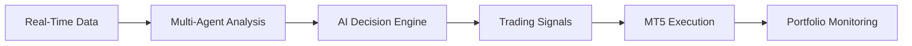
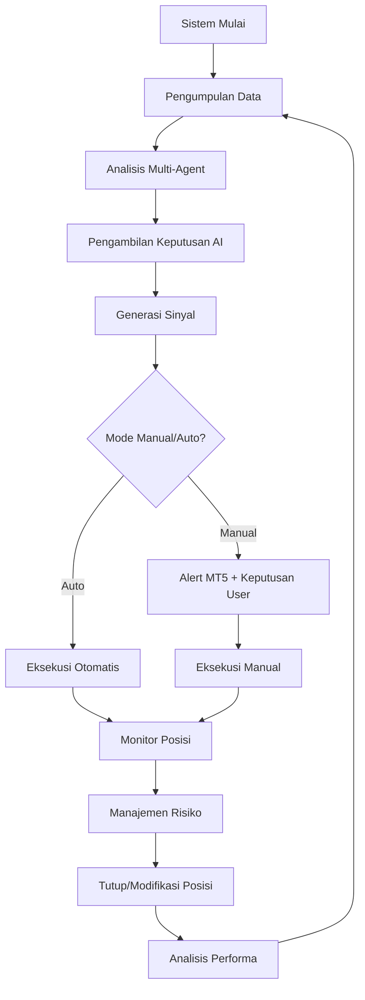

# 🚀 CryptSIST - Sistem Trading Cryptocurrency Berbasis AI

> **CryptSIST** (Cryptocurrency Sentiment Intelligence and Signal Trading) adalah sistem trading otomatis untuk cryptocurrency y### **📝 Penjelasan Komponen Utama**

#### **🚀 Mesin Inti (`main.py`)**
- **Orkestrator proses** - Mengatur semua komponen sistem
- **Manajemen multi-proses** - Menangani server, bridge, dan agen
- **Penanganan & pemulihan error** - Auto-restart pada kegagalan
- **Logging & monitoring** - Sistem logging yang komprehensif

#### **🌐 Server Web (`server/mt5_server.py`)**
- **REST API FastAPI** - Endpoint untuk generasi sinyal
- **Dukungan WebSocket** - Streaming data real-time  
- **CORS diaktifkan** - Dukungan permintaan lintas domain
- **Dokumentasi otomatis** - Swagger UI di `/docs`

#### **🌉 Jembatan MT5 (`bridge/mt5_bridge.py`)**
- **Wrapper API MT5** - Interface Python yang disederhanakan
- **Manajemen koneksi** - Fungsionalitas auto-reconnect
- **Eksekusi trading** - Penempatan dan manajemen order
- **Monitoring akun** - Status akun real-timen analisis sentimen, AI decision engine, dan trading signals real-time dengan MetaTrader 5.

[](https://python.org)
[](https://www.metatrader5.com)
[](https://fastapi.tiangolo.com)
[](LICENSE)

## 📋 **Daftar Isi**

- [Definisi & Gambaran Umum](#-definisi--gambaran-umum)
- [Fitur Utama](#-fitur-utama)
- [Arsitektur Multi-Agent](#-arsitektur-multi-agent)
- [Struktur Program](#-struktur-program)
- [Instalasi](#-instalasi)
- [Konfigurasi](#-konfigurasi)
- [Cara Penggunaan](#-cara-penggunaan)
- [Dokumentasi API](#-dokumentasi-api)
- [Pemecahan Masalah](#-pemecahan-masalah)
- [Kontribusi](#-kontribusi)

## 🎯 **Definisi & Gambaran Umum**

### **Apa itu CryptSIST?**

**CryptSIST** adalah sistem trading cryptocurrency yang revolusioner yang menggabungkan:

1. **🧠 Artificial Intelligence** - Menggunakan Groq LLM untuk analisis mendalam
2. **📊 Multi-Source Analysis** - Analisis teknikal, fundamental, dan sentimen
3. **⚡ Real-Time Processing** - Update setiap 500ms untuk capture micro-trends
4. **🤖 Multi-Agent Architecture** - Tim AI agents yang bekerja sama menganalisis pasar
5. **📈 MetaTrader 5 Integration** - Eksekusi trading otomatis dan manual
6. **🎯 High-Precision Signals** - Signal BUY/SELL/HOLD dengan confidence scoring

### **Bagaimana CryptSIST Bekerja?**



CryptSIST menggunakan **5 tim AI agents** yang bekerja secara bersamaan:

- **📊 Tim Analisis** - Mengumpulkan data harga, berita, dan sentimen
- **🔬 Tim Riset** - Debat antara bull vs bear perspective  
- **⚖️ Tim Manajemen Risiko** - Evaluasi risiko dengan 3 tingkat toleransi
- **🤖 AI Decision Engine** - Mengintegrasikan semua analisis untuk keputusan final
- **📈 Tim Eksekusi** - Menjalankan trading signals di MetaTrader 5

## ⭐ **Fitur Utama**

### **🚀 Real-Time Analysis Engine**
- **Ultra-fast processing** - Analisis setiap 500ms
- **Multi-timeframe analysis** - 1m, 5m, 15m, 1h, 4h, 1D
- **Live market sentiment** - Tracking emosi pasar real-time
- **Instant signal generation** - BUY/SELL/HOLD dengan confidence %

### **🧠 Advanced AI Integration**
- **Groq LLM integration** - State-of-the-art language model
- **Multi-source data fusion** - Price + News + Social sentiment
- **Confidence scoring** - Setiap signal dengan probabilitas keberhasilan
- **Adaptive learning** - System belajar dari performa trading

### **📊 Comprehensive Market Analysis**
```
📈 Technical Analysis      📰 News Analysis         🎭 Sentiment Analysis
├── RSI & MACD            ├── CryptoPanic API      ├── VADER Sentiment
├── Bollinger Bands       ├── Market news feeds    ├── TextBlob Analysis  
├── Moving Averages       ├── Social media trends  ├── FinBERT Model
├── Support/Resistance    ├── Regulatory updates   └── Fear & Greed Index
└── Volume Analysis       └── Technical events     
```

### **⚡ MetaTrader 5 Integration**
- **Native MT5 support** - EA dan Indicator terintegrasi
- **Real-time dashboard** - Visual signals di chart MT5
- **Auto trade execution** - Eksekusi otomatis atau manual
- **Risk management** - Stop loss, take profit, position sizing
- **Performance tracking** - Statistik trading real-time

### **🛡️ Advanced Risk Management**
- **Multi-level risk profiles** - Conservative, Balanced, Aggressive
- **Dynamic position sizing** - Berdasarkan volatilitas dan confidence
- **Portfolio diversification** - Auto-balancing multiple crypto pairs
- **Drawdown protection** - Emergency stop mechanisms

## 🏗️ **Arsitektur Multi-Agent**

CryptSIST menggunakan arsitektur multi-agent yang sophisticated untuk menganalisis pasar cryptocurrency:

### **Tim Analisis (Data Collection)**
```python
🔍 Price Agent (EnhancedPriceFetcher)
├── Binance API - Real-time price data
├── Alpha Vantage - Historical data
├── CoinDesk API - Market metrics
└── OHLCV + Volume analysis

📰 News Agent (News Analyzer) 
├── CryptoPanic API - Crypto news
├── NewsAPI - Global market news
├── Social media sentiment
└── Regulatory updates

🧠 Sentiment Agent (CryptoSentimentAnalyzer)
├── VADER Sentiment Analysis
├── TextBlob Processing
├── FinBERT Model
└── Fear & Greed Index
```

### **Tim Riset (Analysis & Debate)**
```python
🐂 Bull Agent - Mencari sinyal positif
├── Growth indicators
├── Positive news impact
├── Technical breakouts
└── Momentum signals

🐻 Bear Agent - Identifikasi risiko
├── Decline signals  
├── Negative catalysts
├── Technical breakdowns
└── Risk factors

⚖️ Risk Manager - Balanced perspective
├── Portfolio assessment
├── Risk-reward evaluation
├── Strategy validation
└── Position recommendations
```

### **AI Decision Engine**
```python
🤖 SimpleGroqClient (LLM Integration)
├── Multi-source data synthesis
├── Confidence scoring algorithm
├── Signal generation logic
└── Risk-adjusted recommendations

📊 Enhanced Signal Generator
├── Technical pattern recognition
├── News impact scoring
├── Sentiment weight calculation
└── Final signal compilation
```

## 📁 **Struktur Program**

```
CryptSIST/
├── 📄 main.py                                    # 🚀 Main launcher & orchestrator
├── 📄 requirements.txt                           # 📦 Python dependencies
├── 📄 README.md                                  # 📖 Documentation (this file)
├── 📄 launch_cryptsist_realtime.bat             # 🏃 File mulai cepat batch
├── 📄 CRYPTSIST_REALTIME_PRO_GUIDE.md          # 📚 Panduan lengkap pengguna
├── 📄 MULTI_AGENT_ARCHITECTURE_DIAGRAM.md      # 🏗️ Dokumentasi arsitektur
├── 📄 KERANGKA_PROYEK_PENELITIAN.md            # 🔬 Kerangka penelitian
│
├── 📂 server/                                    # 🌐 Server Web FastAPI
│   └── 📄 mt5_server.py                        # Server REST API utama
│
├── 📂 bridge/                                    # 🌉 Jembatan Komunikasi MT5  
│   └── 📄 mt5_bridge.py                        # Konektor Python-MT5
│
├── 📂 experts/                                   # 🤖 Expert Advisors MetaTrader 5
│   └── 📄 CryptSIST_RealTime_Pro.mq5           # EA trading utama
│
├── 📂 indicators/                                # 📊 Indikator MT5 Kustom
│   └── 📄 CryptSIST_RealTime_Indicator.mq5     # Visualisasi sinyal
│
├── 📂 dependencies/                              # 🧩 Modul Python Inti
│   ├── 📄 enhanced_price_fetcher.py            # 💰 Data harga multi-sumber
│   ├── 📄 enhanced_signal_generator.py         # 📈 Generasi sinyal AI
│   ├── 📄 sentiment_analyzer.py                # 🎭 Mesin analisis sentimen
│   └── 📄 simple_groq_client.py                # 🧠 Integrasi Groq LLM
│
├── 📂 config/                                    # ⚙️ File Konfigurasi
│   └── 📄 api_keys_config.py                   # 🔐 Manajemen kunci API
│
└── 📂 launchers/                                 # 🚀 Skrip Peluncur
    ├── 📄 launch_mt5_integration.bat            # Peluncur batch Windows
    └── 📄 launch_mt5_integration.ps1            # Peluncur PowerShell
```

### **� Penjelasan Komponen Utama**

#### **�🚀 Core Engine (`main.py`)**
- **Process orchestrator** - Mengatur semua komponen system
- **Multi-process management** - Handle server, bridge, dan agents
- **Error handling & recovery** - Auto-restart pada failure
- **Logging & monitoring** - Comprehensive system logging

#### **🌐 Web Server (`server/mt5_server.py`)**
- **FastAPI REST API** - Endpoint untuk signal generation
- **WebSocket support** - Real-time data streaming  
- **CORS enabled** - Cross-origin request support
- **Auto-documentation** - Swagger UI at `/docs`

#### **🌉 MT5 Bridge (`bridge/mt5_bridge.py`)**
- **MT5 API wrapper** - Simplified Python interface
- **Connection management** - Auto-reconnect functionality
- **Trade execution** - Order placement dan management
- **Account monitoring** - Real-time account status

#### **🧩 Modul Dependencies**

```python
📊 enhanced_price_fetcher.py
├── Agregasi harga multi-exchange
├── Data OHLCV real-time
├── Manajemen data historis
└── Sistem peringatan harga

🎯 enhanced_signal_generator.py  
├── Mesin analisis teknikal
├── Pengenalan pola
├── Scoring kepercayaan sinyal
└── Analisis multi-timeframe

🧠 sentiment_analyzer.py
├── Pemrosesan sentimen berita
├── Analisis media sosial
├── Pelacakan rasa takut/keserakahan pasar
└── Algoritma scoring sentimen

🤖 simple_groq_client.py
├── Integrasi API LLM
├── Rekayasa prompt
├── Pemrosesan respons
└── Penanganan error
```

## 🔧 **Instalasi**

### **📋 Persyaratan Sistem**

```yaml
Operating System: Windows 10/11 (untuk MT5)
Python: 3.8 atau lebih baru
MetaTrader 5: Latest version
RAM: Minimum 8GB (Recommended 16GB)
Storage: 5GB free space
Internet: Stable connection untuk real-time data
```

### **🚀 Langkah Instalasi**

#### **1️⃣ Clone Repository**
```bash
git clone https://github.com/your-username/CryptSIST.git
cd CryptSIST
```

#### **2️⃣ Instal Dependencies Python**
```bash
# Instal semua requirements
pip install -r requirements.txt

# Atau instal satu per satu (jika ada error)
pip install fastapi==0.104.1
pip install uvicorn[standard]==0.24.0
pip install pandas numpy requests aiohttp
pip install yfinance ccxt textblob vaderSentiment
pip install groq MetaTrader5 python-dotenv
pip install scikit-learn transformers redis structlog
```

#### **3️⃣ Instal MetaTrader 5**
1. **Download MT5** dari [MetaQuotes](https://www.metatrader5.com/en/download)
2. **Instal dan setup** akun demo atau live
3. **Aktifkan algorithmic trading** di Tools > Options > Expert Advisors
4. **Copy file EA** ke folder `MQL5/Experts/`
5. **Copy file Indicator** ke folder `MQL5/Indicators/`

#### **4️⃣ Verifikasi Instalasi**
```bash
# Check Python version
python --version

# Check packages
pip list | findstr fastapi
pip list | findstr MetaTrader5

# Test MT5 connection
python -c "import MetaTrader5 as mt5; print('MT5 OK' if mt5.initialize() else 'MT5 Error')"
```

## ⚙️ **Konfigurasi**

### **🔐 Pengaturan Kunci API**

#### **1️⃣ Edit File Konfigurasi**
```python
# config/api_keys_config.py
API_KEYS = {
    # Groq LLM API (Required)
    'GROQ_API_KEY': 'your_groq_api_key_here',
    
    # News APIs (Optional but recommended)
    'NEWS_API_KEY': 'your_newsapi_key_here',
    'CRYPTOPANIC_API_KEY': 'your_cryptopanic_key_here',
    
    # Price Data APIs (Optional - fallback untuk yfinance)
    'ALPHA_VANTAGE_API_KEY': 'your_alphavantage_key_here',
    'BINANCE_API_KEY': 'your_binance_key_here',
    'BINANCE_SECRET_KEY': 'your_binance_secret_here',
}

# Konfigurasi Trading
TRADING_CONFIG = {
    'DEFAULT_RISK_LEVEL': 'BALANCED',  # CONSERVATIVE, BALANCED, AGGRESSIVE
    'MAX_CONCURRENT_TRADES': 5,
    'DEFAULT_STOP_LOSS_PCT': 2.0,
    'DEFAULT_TAKE_PROFIT_PCT': 6.0,
    'MIN_CONFIDENCE_THRESHOLD': 70.0,
    'ENABLE_AUTO_TRADING': False,  # Set True untuk auto-trading
}

# Pasangan Crypto untuk Dipantau
CRYPTO_PAIRS = [
    'BTCUSD', 'ETHUSD', 'ADAUSD', 'DOTUSD', 'LINKUSD',
    'LTCUSD', 'BCHUSD', 'XLMUSD', 'TRXUSD', 'EOSUSD'
]
```

#### **2️⃣ Dapatkan API Keys**

**🤖 Groq API (WAJIB)**
1. Kunjungi [Groq Console](https://console.groq.com/)
2. Daftar akun gratis
3. Generate API key
4. Copy ke `GROQ_API_KEY`

**📰 News API (Opsional)**
1. **NewsAPI**: [newsapi.org](https://newsapi.org/) - 1000 request/hari gratis
2. **CryptoPanic**: [cryptopanic.com](https://cryptopanic.com/developers/) - 1000 request/hari gratis

**💰 Price Data API (Opsional)**
1. **Alpha Vantage**: [alphavantage.co](https://www.alphavantage.co/support/#api-key) - 500 request/hari gratis
2. **Binance**: [binance.com](https://www.binance.com/en/binance-api) - Rate limit tinggi

### **🎯 Konfigurasi MT5**

#### **1️⃣ Pengaturan Expert Advisor**
```mql5
// Copy file ke: MT5_DATA_FOLDER/MQL5/Experts/
CryptSIST_RealTime_Pro.mq5

// Settings EA:
API_URL = "http://localhost:8000"  // CryptSIST server URL
UPDATE_INTERVAL = 500              // Update setiap 500ms  
AUTO_TRADING = false               // Manual approval trading
MAX_RISK_PCT = 2.0                // Max risk per trade
ENABLE_DASHBOARD = true            // Show visual dashboard
```

#### **2️⃣ Pengaturan Indicator**
```mql5
// Copy file ke: MT5_DATA_FOLDER/MQL5/Indicators/
CryptSIST_RealTime_Indicator.mq5

// Settings Indicator:
SIGNAL_ARROWS = true               // Show BUY/SELL arrows
CONFIDENCE_DISPLAY = true          // Show confidence %
SENTIMENT_PANEL = true             // Show market sentiment
UPDATE_FREQUENCY = 1000            // Update setiap 1 detik
```

## 🚀 **Cara Penggunaan**

### **🏃 Mulai Cepat - Metode Tercepat**

#### **1️⃣ Peluncuran Satu Klik**
```bash
# Double-click pada file ini:
launch_cryptsist_realtime.bat

# Atau jalankan via PowerShell:
.\launch_cryptsist_realtime.bat
```

#### **2️⃣ Peluncuran Manual**
```bash
# Metode 1: Python launcher (Recommended)
python main.py

# Metode 2: Manual start semua komponen
# Terminal 1 - Start server
python server/mt5_server.py

# Terminal 2 - Start bridge  
python bridge/mt5_bridge.py
```

### **📊 Dashboard Monitoring**

Setelah sistem berjalan, Anda dapat mengakses:

#### **🌐 Dashboard Web**
```
http://localhost:8000          # Dashboard utama
http://localhost:8000/docs     # Dokumentasi API
http://localhost:8000/signals  # Sinyal real-time
http://localhost:8000/health   # Status sistem
```

#### **📈 Integrasi MT5**
1. **Buka MetaTrader 5**
2. **Pasang EA** `CryptSIST_RealTime_Pro` ke chart BTCUSD
3. **Tambah Indicator** `CryptSIST_RealTime_Indicator` 
4. **Monitor sinyal** real-time di chart

### **🎯 Alur Kerja Trading**

#### **📋 Proses Trading Langkah-demi-Langkah**



#### **🔄 Operasi Real-Time**

**⚡ Setiap 500ms Sistem Melakukan:**
1. **📊 Ambil data** - Harga, volume, berita, sentimen
2. **🤖 Analisis multi-agent** - 5 tim AI menganalisis
3. **🧠 Keputusan AI** - Groq LLM mengintegrasikan hasil
4. **📈 Generate sinyal** - BUY/SELL/HOLD dengan confidence
5. **📱 Kirim ke MT5** - Update dashboard dan trigger alert
6. **⚖️ Cek risiko** - Validasi dengan aturan manajemen risiko

**📱 Output yang Anda Terima:**
```
🟢 STRONG BUY - BTCUSD (87.3% Confidence)
├── 📈 Technical: Bullish breakout detected
├── 📰 News: Positive sentiment (8/10)  
├── 🎭 Market: BULLISH momentum
├── 💰 Entry: $43,250
├── 🎯 Take Profit: $45,850 (+6.0%)
├── 🛡️ Stop Loss: $42,385 (-2.0%)
└── ⏱️ Signal Time: 14:23:45
```

### **⚙️ Konfigurasi Lanjutan**

#### **🎛️ Pengaturan Manajemen Risiko**
```python
# Tiga tingkat risk profile:

# 🛡️ CONSERVATIVE (Recommended untuk pemula)
CONSERVATIVE_CONFIG = {
    'max_risk_per_trade': 1.0,     # 1% per trade
    'max_daily_risk': 3.0,         # 3% per hari
    'min_confidence': 80.0,        # Hanya signal >80%
    'stop_loss': 1.5,              # Stop loss 1.5%
    'take_profit': 4.5,            # Take profit 3x risk
    'max_concurrent': 2,           # Max 2 position bersamaan
}

# ⚖️ BALANCED (Recommended untuk trader berpengalaman)  
BALANCED_CONFIG = {
    'max_risk_per_trade': 2.0,     # 2% per trade
    'max_daily_risk': 6.0,         # 6% per hari  
    'min_confidence': 70.0,        # Signal >70%
    'stop_loss': 2.0,              # Stop loss 2%
    'take_profit': 6.0,            # Take profit 3x risk
    'max_concurrent': 5,           # Max 5 position
}

# 🔥 AGGRESSIVE (Hanya untuk trader expert)
AGGRESSIVE_CONFIG = {
    'max_risk_per_trade': 5.0,     # 5% per trade
    'max_daily_risk': 15.0,        # 15% per hari
    'min_confidence': 60.0,        # Signal >60%  
    'stop_loss': 3.0,              # Stop loss 3%
    'take_profit': 9.0,            # Take profit 3x risk
    'max_concurrent': 10,          # Max 10 position
}
```

#### **📊 Konfigurasi Asset Kustom**
```python
# Tambah pasangan crypto untuk monitoring
CUSTOM_PAIRS = {
    # Pasangan Utama (Likuiditas tinggi)
    'BTCUSD': {'spread': 0.1, 'min_volume': 1000000},
    'ETHUSD': {'spread': 0.2, 'min_volume': 500000},
    
    # Alt Coins (Likuiditas menengah)  
    'ADAUSD': {'spread': 0.5, 'min_volume': 100000},
    'DOTUSD': {'spread': 0.5, 'min_volume': 100000},
    
    # Small Caps (Likuiditas rendah)
    'SOLUSD': {'spread': 1.0, 'min_volume': 50000},
    'AVAXUSD': {'spread': 1.0, 'min_volume': 50000},
}

# Analisis time frame
TIMEFRAMES = {
    'scalping': ['1m', '5m'],      # Ultra jangka pendek
    'daytrading': ['15m', '1h'],   # Intraday
    'swing': ['4h', '1d'],         # Multi-hari
    'position': ['1d', '1w'],      # Jangka panjang
}
```

## 📊 **Dokumentasi API**

### **🌐 Endpoint REST API**

#### **📡 Sinyal Real-Time**
```http
GET /signals/{symbol}
```
**Response:**
```json
{
  "symbol": "BTCUSD",
  "signal": "BUY",
  "confidence": 87.3,
  "price": 43250.00,
  "timestamp": "2025-08-19T14:23:45",
  "analysis": {
    "technical": {
      "trend": "bullish",
      "rsi": 68.5,
      "macd": "bullish_crossover",
      "bollinger": "middle_bounce"
    },
    "sentiment": {
      "news_score": 8.2,
      "social_score": 7.8,
      "overall": "positive"
    },
    "fundamentals": {
      "volume": "high",
      "volatility": "medium",
      "market_cap_rank": 1
    }
  },
  "risk_management": {
    "entry_price": 43250.00,
    "stop_loss": 42385.00,
    "take_profit": 45850.00,
    "risk_reward_ratio": 3.0,
    "position_size": "2.3%"
  }
}
```

#### **📊 Ringkasan Pasar**
```http
GET /market/overview
```
**Response:**
```json
{
  "market_sentiment": "BULLISH",
  "fear_greed_index": 72,
  "active_signals": 5,
  "top_performers": [
    {"symbol": "BTCUSD", "change_24h": 5.2},
    {"symbol": "ETHUSD", "change_24h": 3.8}
  ],
  "market_alerts": [
    "Bitcoin breaking resistance at $43,000",
    "Ethereum showing strong momentum"
  ]
}
```

#### **⚙️ Kesehatan Sistem**
```http
GET /health
```
**Response:**
```json
{
  "status": "healthy",
  "uptime": "2h 45m 30s", 
  "components": {
    "price_fetcher": "online",
    "sentiment_analyzer": "online",
    "signal_generator": "online",
    "mt5_bridge": "connected",
    "groq_api": "active"
  },
  "performance": {
    "requests_per_minute": 120,
    "average_response_time": "150ms",
    "success_rate": "99.2%"
  }
}
```

### **🔌 Streaming WebSocket**

#### **📡 Stream Harga Real-Time**
```javascript
const ws = new WebSocket('ws://localhost:8000/ws/prices');

ws.onmessage = function(event) {
    const data = JSON.parse(event.data);
    console.log('Update Harga:', data);
    // { symbol: "BTCUSD", price: 43250.00, change: +1.2% }
};
```

#### **🚨 Stream Alert Sinyal**  
```javascript
const ws = new WebSocket('ws://localhost:8000/ws/signals');

ws.onmessage = function(event) {
    const signal = JSON.parse(event.data);
    if(signal.confidence > 80) {
        showAlert(`${signal.signal} ${signal.symbol} - ${signal.confidence}%`);
    }
};
```

## 🛠️ **Pemecahan Masalah**

### **❌ Masalah Umum & Solusi**

#### **🔌 Masalah Koneksi MT5**
```
Masalah: Error "MT5 not connected"
Solusi:
1. Periksa apakah MT5 sedang berjalan
2. Aktifkan "Allow automated trading" di MT5
3. Restart MT5 dan CryptSIST
4. Periksa pengaturan Windows firewall

Perintah untuk test:
python -c "import MetaTrader5 as mt5; print(mt5.initialize())"
```

#### **🔑 Masalah Kunci API**
```
Masalah: Error "Invalid API key"
Solusi:
1. Verifikasi kunci API di config/api_keys_config.py
2. Periksa izin dan kuota kunci
3. Test setiap API secara individual
4. Periksa spasi tambahan di kunci

Test Groq API:
curl -H "Authorization: Bearer YOUR_KEY" https://api.groq.com/openai/v1/models
```

#### **🌐 Masalah Jaringan & Performa**
```
Masalah: Respons lambat atau timeout
Solusi:
1. Periksa stabilitas koneksi internet
2. Tingkatkan nilai timeout di config
3. Kurangi frekuensi update jika perlu
4. Periksa resource sistem (RAM/CPU)

Cek performa:
GET /health endpoint untuk status sistem
```

#### **📊 Masalah Kualitas Sinyal**
```
Masalah: Sinyal confidence rendah atau sinyal palsu
Solusi:
1. Tingkatkan threshold confidence minimum
2. Tambah lebih banyak sumber data
3. Sesuaikan pengaturan manajemen risiko
4. Gunakan time frame lebih panjang untuk akurasi lebih baik

Optimisasi:
- Minimum confidence: 75%+ untuk live trading
- Kombinasi multiple timeframes
- Monitor win rate dan sesuaikan parameter
```

### **🔧 Pemecahan Masalah Lanjutan**

#### **📝 Aktifkan Debug Logging**
```python
# Add to main.py
import logging
logging.basicConfig(
    level=logging.DEBUG,
    format='%(asctime)s - %(name)s - %(levelname)s - %(message)s',
    handlers=[
        logging.FileHandler('cryptsist_debug.log'),
        logging.StreamHandler()
    ]
)
```

#### **🔍 Cek Kesehatan Komponen**
```bash
# Cek komponen individual
python -c "from dependencies.enhanced_price_fetcher import *; test_connection()"
python -c "from dependencies.sentiment_analyzer import *; test_sentiment()"
python -c "from dependencies.simple_groq_client import *; test_groq_api()"
```

#### **🚨 Prosedur Darurat**
```bash
# Hentikan semua trading segera
curl -X POST http://localhost:8000/emergency/stop_all_trades

# Reset state sistem
curl -X POST http://localhost:8000/system/reset

# Export posisi saat ini
curl -X GET http://localhost:8000/portfolio/export > positions_backup.json
```

## 🤝 **Kontribusi**

### **🔄 Alur Kerja Pengembangan**

#### **1️⃣ Setup Environment Pengembangan**
```bash
# Fork repository
git fork https://github.com/your-username/CryptSIST.git

# Clone fork Anda
git clone https://github.com/your-username/CryptSIST.git
cd CryptSIST

# Buat virtual environment
python -m venv venv
venv\Scripts\activate  # Windows
source venv/bin/activate  # Linux/Mac

# Instal dev dependencies
pip install -r requirements.txt
pip install pytest pytest-asyncio black flake8
```

#### **2️⃣ Style Kode & Standar**
```bash
# Format kode dengan Black
black .

# Cek style kode
flake8 .

# Jalankan test
pytest tests/ -v

# Type checking (jika menggunakan)
mypy dependencies/
```

#### **3️⃣ Panduan Kontribusi**

**📋 Sebelum Berkontribusi:**
- 🔍 Cek issue dan PR yang ada
- 📝 Buat issue untuk feature request
- 🧪 Tulis test untuk fitur baru  
- 📖 Update dokumentasi

**🔀 Proses Pull Request:**
1. **Buat feature branch**: `git checkout -b feature/fitur-amazing`
2. **Buat perubahan** dengan testing yang proper
3. **Update docs** jika perlu
4. **Submit PR** dengan deskripsi yang jelas

**📝 Format Commit Message:**
```
feat: tambah analisis sentimen untuk token DeFi
fix: resolve masalah timeout koneksi MT5  
docs: update panduan instalasi
test: tambah unit test untuk signal generator
```

### **🎯 Area untuk Kontribusi**

#### **🚀 Prioritas Tinggi**
- 📱 Pengembangan aplikasi mobile
- 🔍 Indikator teknikal tambahan
- 🌐 Peningkatan dashboard web
- 📊 Fitur charting lanjutan
- 🤖 Integrasi lebih banyak model AI

#### **🛠️ Prioritas Menengah**  
- 📈 Algoritma optimisasi portfolio
- 🔔 Sistem notifikasi yang enhanced
- 📊 Mesin backtesting historis
- 🌍 Dukungan multi-bahasa
- 📚 Tutorial video

#### **💡 Ide yang Diterima**
- 🎨 Peningkatan UI/UX
- ⚡ Optimisasi performa
- 🔒 Peningkatan keamanan
- 📖 Peningkatan dokumentasi
- 🧪 Coverage testing

### **📞 Dukungan & Komunitas**

#### **🆘 Dapatkan Bantuan**
- 📧 **Email**: cryptsist.support@email.com
- 💬 **Discord**: [Komunitas CryptSIST](https://discord.gg/cryptsist)
- 🐛 **Issues**: [GitHub Issues](https://github.com/your-username/CryptSIST/issues)
- 📖 **Wiki**: [Dokumentasi](https://github.com/your-username/CryptSIST/wiki)

#### **🤝 Panduan Komunitas**
- ✅ Bersikap sopan dan konstruktif
- 🚫 Jangan spam atau konten promosi
- 💡 Berbagi pengetahuan dan bantu orang lain
- 🔒 Jangan share kunci API atau info pribadi
- 📈 Share hasil trading secara bertanggung jawab

---

## 📄 **License**

```
MIT License

Copyright (c) 2025 CryptSIST Project

Permission is hereby granted, free of charge, to any person obtaining a copy
of this software and associated documentation files (the "Software"), to deal
in the Software without restriction, including without limitation the rights
to use, copy, modify, merge, publish, distribute, sublicense, and/or sell
copies of the Software, and to permit persons to whom the Software is
furnished to do so, subject to the following conditions:

The above copyright notice and this permission notice shall be included in all
copies or substantial portions of the Software.

THE SOFTWARE IS PROVIDED "AS IS", WITHOUT WARRANTY OF ANY KIND, EXPRESS OR
IMPLIED, INCLUDING BUT NOT LIMITED TO THE WARRANTIES OF MERCHANTABILITY,
FITNESS FOR A PARTICULAR PURPOSE AND NONINFRINGEMENT. IN NO EVENT SHALL THE
AUTHORS OR COPYRIGHT HOLDERS BE LIABLE FOR ANY CLAIM, DAMAGES OR OTHER
LIABILITY, WHETHER IN AN ACTION OF CONTRACT, TORT OR OTHERWISE, ARISING FROM,
OUT OF OR IN CONNECTION WITH THE SOFTWARE OR THE USE OR OTHER DEALINGS IN THE
SOFTWARE.
```

---

## 🏆 **Penghargaan**

**🙏 Terima Kasih Khusus Kepada:**
- **MetaQuotes** - Platform MetaTrader 5
- **Groq** - API LLM yang canggih
- **FastAPI** - Framework web modern
- **Binance** - API exchange cryptocurrency
- **NewsAPI** - Layanan agregasi berita
- **Komunitas Open Source** - Berbagai library dan tools

**📚 Paper Penelitian & Referensi:**
- *"Multi-Agent Systems for Financial Trading"* - MIT Press
- *"Sentiment Analysis in Cryptocurrency Markets"* - Journal of Finance
- *"Real-Time Signal Processing for Algorithmic Trading"* - IEEE

---

<div align="center">

## ⭐ **Beri Bintang pada Repository Ini!**

**Jika CryptSIST membantu Anda dalam trading, mohon berikan kami bintang! ⭐**

[](https://github.com/your-username/CryptSIST)
[](https://github.com/your-username/CryptSIST/fork)

**🚀 Selamat Trading dengan CryptSIST! 📈**

*"Memberdayakan trader dengan insight berbasis AI untuk keputusan trading cryptocurrency yang lebih cerdas."*

</div>
